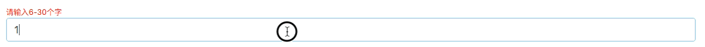
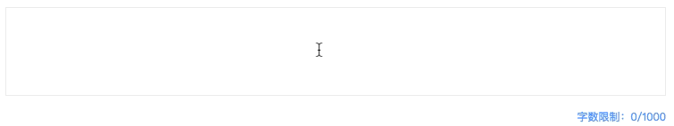
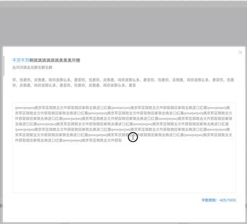
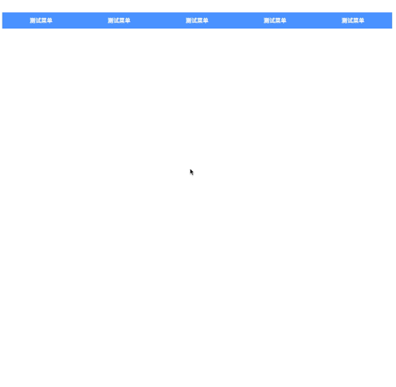
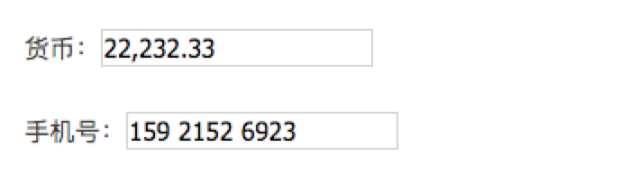

<p align="center">
  <a href="https://github.com/976500133/rtcs">
    
  </a>
</p>

# Rtcs


[]()

[]()
[]()


## Features(特性)

- Easy to use, with a series of components and plugin
- A set of high-quality React components out of the box.
- Written in es6 with complete define types.
- A npm + rc-tools  


## Install

```bash
npm install rtcs --save
```


## Usage

```jsx

import { AppleBar }  from 'rtcs'

ReactDOM.render(<AppleBar />, mountNode);

```


## Manually import

```jsx
import AppleBar from 'rtcs/lib/AppleBar';  // for js
import 'rtcs/assets/css/AppleBar.css';        // for css
```


## Support environment

- Modern browsers and IE9 and above.


## API

- RImageMiddle
『图片上下左右居中显示』

```jsx

import { RImageMiddle }  from 'rtcs'

// imageUrl  : 图片地址
// width  : 容器宽
// height  : 容器高
// imgWidth : 图片宽
// imgHeight : 图片高

<RImageMiddle imageUrl="./images/icon-nav2-01.png" width="78" height="78" imgWidth="40" />


```


- AppleBar
『类似苹果下部快捷栏』

```jsx

import { AppleBar }  from 'rtcs'

const _appData = [{
        title : "我的标题", //标题
        image : "./images/home-04.png", //icon 地址
        width : 48, // icon 宽
        cb : () => {alert(0)} //点击回调
      }

//appBarCenterColr 中间隆起区域的背景色

//appBarStyle 自定义css

<AppleBar appBarStyle={} appBarCenterColr="#fff" appData={_appData}/>

```


- RegInput
『对输入框进行正则匹配和错误提示』

```jsx

import { RegInput }  from 'rtcs'

// isblur  Boolean 触发检测的机制，true（blur 校验）/false （实时校验）  默认是 false  
// data-InitCheck Boolean 是否检测默认值 默认为false  
// data-cb Function  回调函数  和 is blur 有关
// data-success String  成功的文字提示
// data-error String 失败的文字提示  
// data-successCssName String  Success那行的className  
// data-errorCssName String  Error那行的className  
// data-reg String 正则表达式 例如  "/^[0-9]{2,6}$/" 只需要写 “^[0-9]{2,6}$"  

// 其他 RegInput 上的属性会继承到 input 标签上

<RegInput className="form-control"  id="projectName" placeholder="填写项目名称" defaultValue="" data-reg="^[0-9]{6,30}$" data-error="请输入6-30个字" data-success="输入正确" />

```




- LimitTextarea
『对textarea 文字字数进行校验个数』

```jsx

import { LimitTextarea }  from 'rtcs'

// data-warnTxt  String 文字提示  
// data-warnTxtCssName String 文字提示的class  
// data-max-length Number 字数限制个数
// data-open-cb  是否开启 回调 ，默认为false
// data-success-cb  回调开启之后的检测成功的函数
// data-error-cb  回调开启之后的检测失败的函数

// 其他 LimitTextarea 上的属性会继承到textarea 标签上


<LimitTextarea data-warnTxt="字数限制" data-warnTxtCssName="fn-right"  data-max-length={1000} className="editArea" defaultValue="这里显示默认值。" />

```





- RTMessage
『自定义消失的弹窗』

```jsx

import { RTMessage }  from 'rtcs'

// keepOpen  Boolean 默认是false 默认 keepTime 之后消失 true 代码 一直不消失
// keepTime Number 默认是2500 毫秒 消失
//<div className="rtmessage-error" >这里显示错误的提示</div> 这里自定义 显示框

<RTMessage keepOpen={false} > <div className="rtmessage-error" >这里显示错误的提示</div></RTMessage>

```



- util3DCard
『3d 卡牌 效果』

```jsx

import { util3DCard }  from 'rtcs'

//唯一参数 Dom元素

util3DCard(document.querySelectorAll('#demo li'))

```


- DOMScrollImage
『图片随着鼠标移动而左右移动』

```jsx

import { DOMScrollImage }  from 'rtcs'

// arguments (moveImage , level = 4)  
// moveImage 移动的元素
// level 移动速度快慢

DOMScrollImage($('#demo'),5)

```


- PerfectScroller
『自定义scrollBar perfect-scrollbar 的react 版本』

```jsx

import { PerfectScroller }  from 'rtcs'


// arguments ($scroller )  
//$scroller 为css 选择器或者 dom 元素
//使用了jquery
PerfectScroller($('#demo'))

```


- injectFixHeaderPlugin
『injectFixHeaderPlugin 浮动菜单』

```jsx

import { injectFixHeaderPlugin }  from 'rtcs'
injectFixHeaderPlugin()

// hideTop:0,                //滚动隐藏的位置
// fixedTop:0,                 //显示的位置
// duration:600,               //动画时长
// autoHide:true ,            // 是否自动影藏
// cb : function(){} ,           //滚动之后的回调
// parentElement : $(document)   //滚动的父元素

$('.homeBody-guaid').injectFixHeaderPlugin({hideTop : 10 , parentElement : $('#homeBody-step')})

```



- animateCssExtend
『animateCssExtend  animate.css jquery扩展』

```jsx

import { animateCssExtend } from 'rtcs'

animateCssExtend()

```


- injectDataFormatPlugin
『injectDataFormatPlugin 数据 format 』

```jsx

import { injectDataFormatPlugin } from 'rtcs'

injectDataFormatPlugin()

// 调用方法：
// $(selector).inputFormat(options,callback);
// type	默认值 'currency'	格式化数据类型:'currency'货币,'mobile'手机号
// tofixed	默认值 2	四舍五入的位数
// callback(api)参数
// format(value)	格式化指定值,返回格式化后结果
// setValue(value)	设置输入框值
$('input[name="phone"]').injectDataFormatPlugin({type:'mobile'});


```

